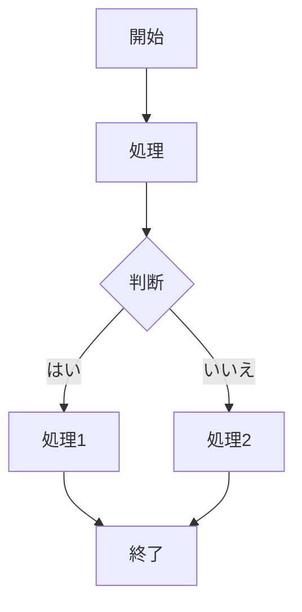
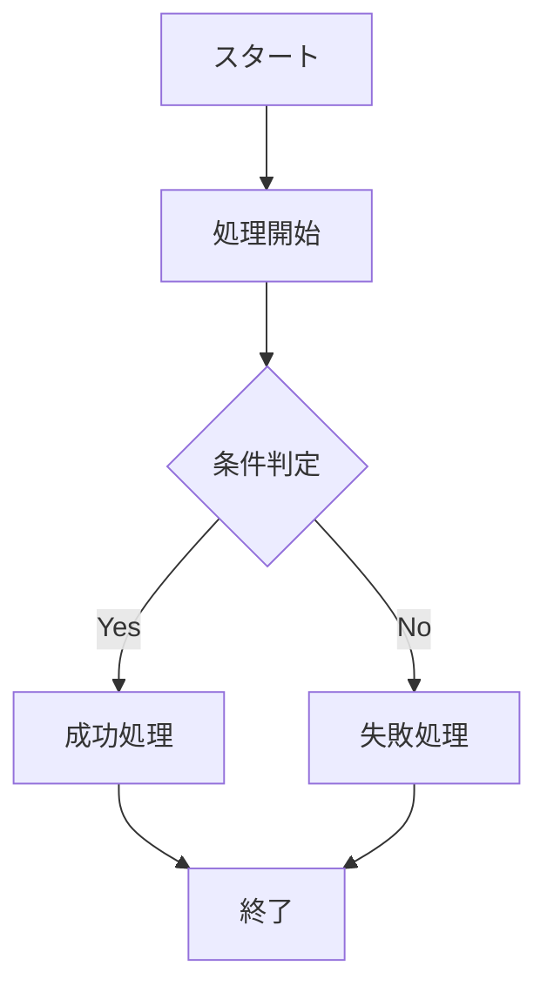
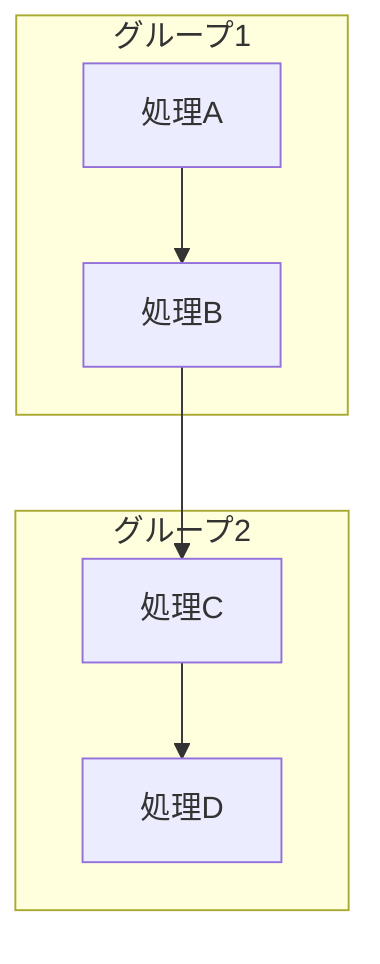
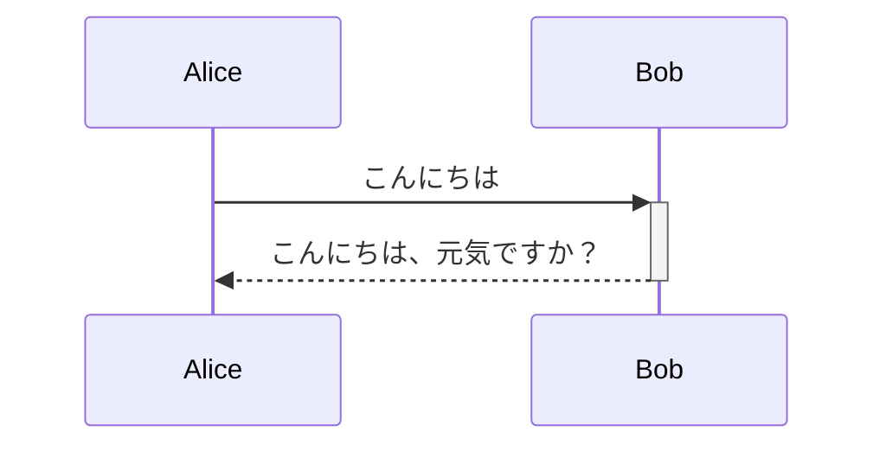
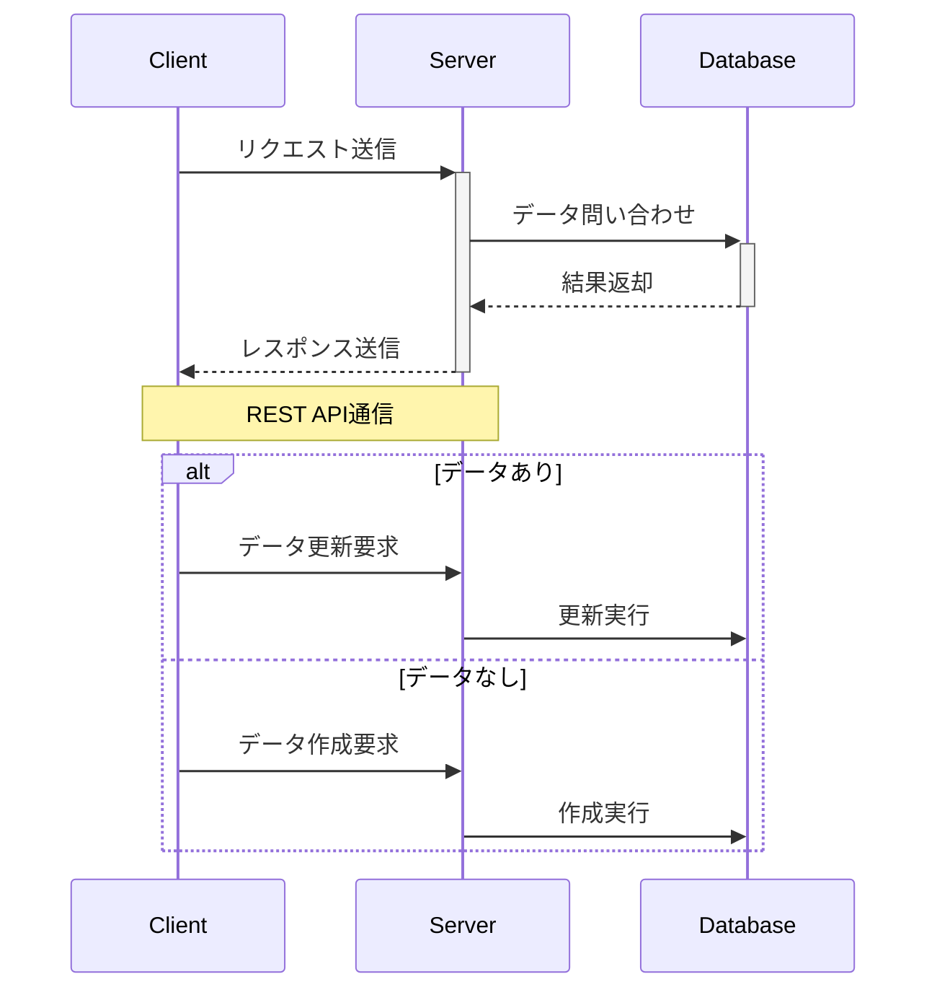
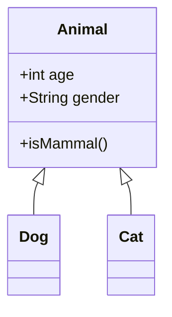
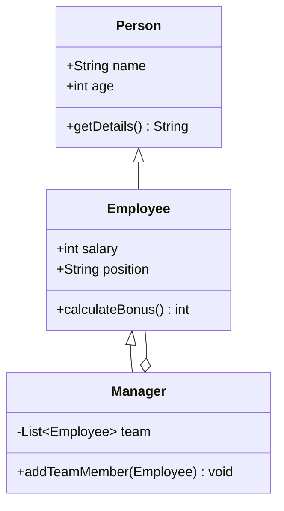
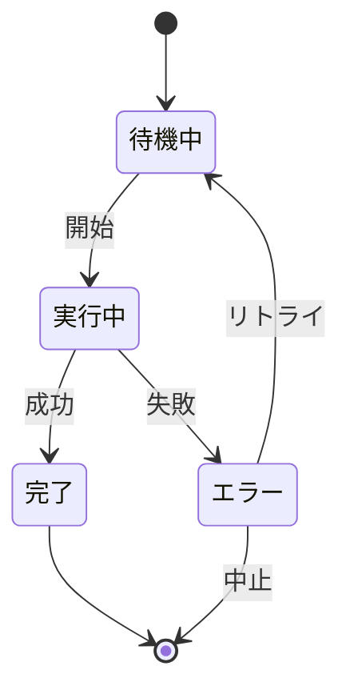
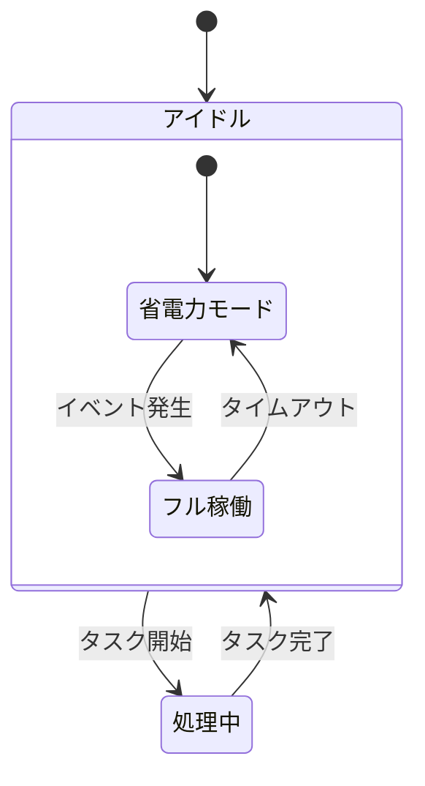
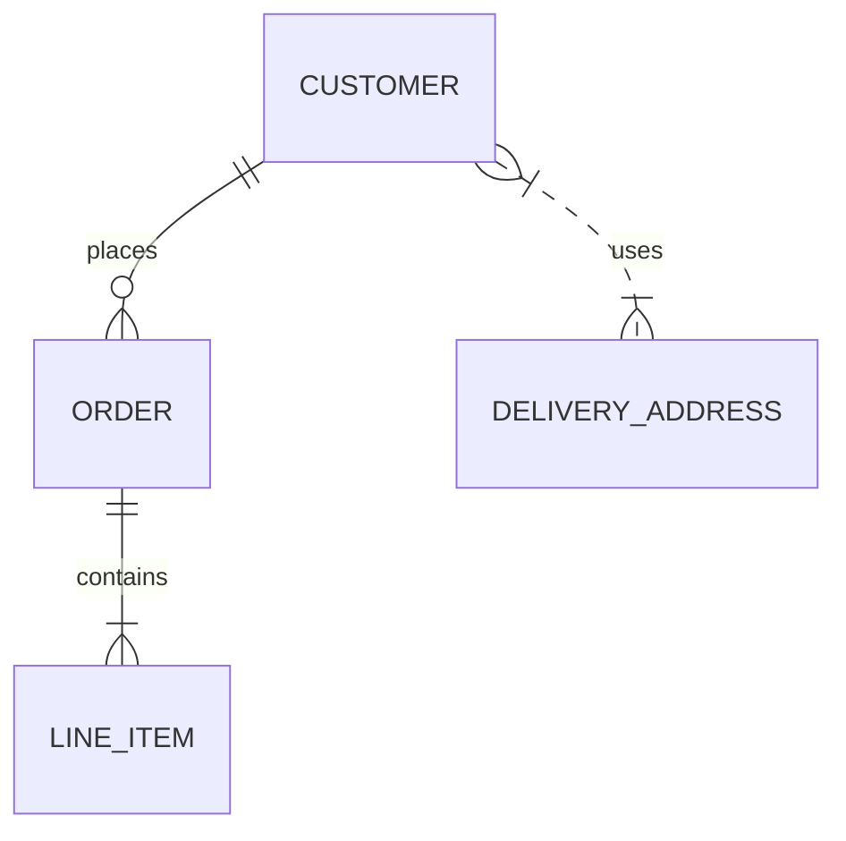

---
tags:
  - program
---
## 目次
- [Mermaidとは](Mermaid記法.md#mermaidとは)
- [Mermaidの基本記法](Mermaid記法.md#mermaidの基本記法)
- [フローチャート](Mermaid記法.md#フローチャート)
- [シーケンス図](Mermaid記法.md#シーケンス図)
- [クラス図](Mermaid記法.md#クラス図)
- [状態図](Mermaid記法.md#状態図)
- [ER図](Mermaid記法.md#er図)
- [ガントチャート](Mermaid記法.md#ガントチャート)
- [ジャーニーチャート](Mermaid記法.md#ジャーニーチャート)
- [Gitグラフ](Mermaid記法.md#gitグラフ)
- [パイチャート](Mermaid記法.md#パイチャート)
- [要件図](Mermaid記法.md#要件図)
- [C4図](Mermaid記法.md#c4図)
- [アーキテクチャダイアグラム](Mermaid記法.md#アーキテクチャダイアグラム)
- [実践的な使用例](Mermaid記法.md#実践的な使用例)
- [よくあるエラーと解決方法](Mermaid記法.md#よくあるエラーと解決方法)
- [まとめ](Mermaid記法.md#まとめ)

## Mermaidとは

**Mermaid（マーメイド）** は、シンプルなテキストベースの記法を使って様々な図表を生成できるJavaScriptライブラリです。Markdown風に書けるため、**ソースコードと同じようにバージョン管理**できるのが大きな強みです。エンジニアやプロダクトマネージャーであれば、テキストの修正だけでフローチャートやシーケンス図などを即座に再生成できるため、**開発ドキュメントのメンテナンス性が向上**します。


## Mermaidの基本記法

Mermaidで図を記述する際は、コードブロック内に「mermaid」言語識別子を指定し、その中に図の定義を記述します。基本的な構文は以下の通りです。

~~~
```mermaid
図の種類 定義
    要素1 関係 要素2
    ...
```
~~~

例えば、シンプルなフローチャートは次のように記述します。



**コードの記述方法:**
~~~

~~~

## フローチャート

フローチャートは、プロセスやワークフローを視覚的に表現するための図です。ノード（処理や判断）を直感的な形状で表し、矢印で流れを示します。



**コードの記述方法:**
~~~

~~~

### フローチャートの重要な要素

1. **方向の指定**:
   - `TD` または `TB`: 上から下 (Top-Down/Top-Bottom)
   - `BT`: 下から上 (Bottom-Top)
   - `LR`: 左から右 (Left-Right)
   - `RL`: 右から左 (Right-Left)

2. **ノードの形状**:
   - `[四角形]`: 処理
   - `(楕円)`: 開始/終了
   - `{ひし形}`: 判定
   - `[[サブルーチン]]`: サブルーチン
   - `[(データベース)]`: データベース
   - `((円))`: 接続点

3. **矢印のスタイル**:
   - `-->`: 実線矢印
   - `==>`: 太線矢印
   - `-.->`： 点線矢印
   - `--o`: 丸印付き線
   - `--x`: バツ印付き線

4. **サブグラフ（グループ化）**:


**コードの記述方法:**
~~~

~~~

## シーケンス図

シーケンス図は、複数のオブジェクト間のメッセージの流れを時系列で表現する図です。システム間の通信や処理の順序を明確に示すのに最適です。



**コードの記述方法:**
~~~

~~~

### シーケンス図の応用例



**コードの記述方法:**
~~~

~~~

### シーケンス図の主要要素

- `participant`: 参加者の定義
- `Note over A,B`: 複数オブジェクトにまたがるノート
- `alt/else/end`: 条件分岐
- `loop/end`: ループ処理
- `activate/deactivate`: アクティベーション（または `+/-` 記号）
- `par/and/end`: 並列処理

## クラス図

クラス図は、オブジェクト指向設計におけるクラス間の関係を表現します。クラスの属性、メソッド、および他クラスとの関連性を視覚化できます。



**コードの記述方法:**
~~~

~~~

### より詳細なクラス図の例



**コードの記述方法:**
~~~

~~~

### クラス図の関係表現

| 記号 | 関係 | 意味 |
|------|------|------|
| `<\|--` | 継承 | 親クラスから子クラスへの継承関係 |
| `*--` | コンポジション | 強い所有関係（部分が全体に強く依存） |
| `o--` | 集約 | 弱い所有関係（部分が全体から独立可能） |
| `-->` | 関連 | クラス間の一般的な関連性 |
| `--` | リンク | 単純な接続 |
| `..>` | 依存 | 一方のクラスが他方に依存 |
| `..\|>` | 実装 | インターフェースの実装 |
| `..` | 点線リンク | 弱い関連 |

## 状態図

状態図は、システムやプロセスの状態遷移を表現するのに適しています。特にワークフローやステータス管理の可視化に役立ちます。



**コードの記述方法:**
~~~

~~~

### 状態図の特徴と応用

- `[*]`: 開始状態または終了状態
- 状態間の遷移は矢印と条件で表現
- `state` キーワードによる詳細な状態定義
- 複合状態によるネスト構造の表現



**コードの記述方法:**
~~~

~~~

## ER図

ER図（Entity-Relationship Diagram）はデータベースの設計を表現するのに使用されます。エンティティ、その属性、およびエンティティ間の関係を示します。



**コードの記述方法:**
~~~
```mermaid
erDiagram
    CUSTOMER ||--o{ ORDER : places
    ORDER ||--|{ LINE_ITEM : contains
    CUSTOMER }|..|{ DELIVERY_ADDRESS : uses
```
~~~

### 詳細なER図の例

```mermaid
erDiagram
    USER {
        int id PK
        string username
        string email
        string password_hash
    }
    
    POST {
        int id PK
        int user_id FK
        string title
        string content
        datetime created_at
    }
    
    COMMENT {
        int id PK
        int post_id FK
        int user_id FK
        string content
        datetime created_at
    }
    
    USER ||--o{ POST : writes
    POST ||--o{ COMMENT : has
    USER ||--o{ COMMENT : makes
```

**コードの記述方法:**
~~~
```mermaid
erDiagram
    USER {
        int id PK
        string username
        string email
        string password_hash
    }
    
    POST {
        int id PK
        int user_id FK
        string title
        string content
        datetime created_at
    }
    
    COMMENT {
        int id PK
        int post_id FK
        int user_id FK
        string content
        datetime created_at
    }
    
    USER ||--o{ POST : writes
    POST ||--o{ COMMENT : has
    USER ||--o{ COMMENT : makes
```
~~~

### ER図の関係表現

| 記法 | 意味 |
|------|------|
| `\|\|--o{` | 一対多（必須から省略可能） |
| `}\|--\|{` | 多対多（必須から必須） |
| `}\|..\|{` | 多対多（省略可能から省略可能） |
| `\|\|--\|\|` | 一対一（必須から必須） |
| `\|\|..o{` | 一対多（必須から省略可能、点線） |

## ガントチャート

ガントチャートは、プロジェクトのスケジュール管理に利用できます。タスク、期間、依存関係を視覚的に表現します。

```mermaid
gantt
    title プロジェクトスケジュール
    dateFormat  YYYY-MM-DD
    section 開発フェーズ
      要件定義     :a1, 2025-03-01, 10d
      設計         :after a1, 15d
    section テストフェーズ
      テスト実施   :2025-04-01, 10d
```

**コードの記述方法:**
~~~
```mermaid
gantt
    title プロジェクトスケジュール
    dateFormat  YYYY-MM-DD
    section 開発フェーズ
      要件定義     :a1, 2025-03-01, 10d
      設計         :after a1, 15d
    section テストフェーズ
      テスト実施   :2025-04-01, 10d
```
~~~

### ガントチャートの詳細設定

- `dateFormat`: 日付形式の指定 (例: `YYYY-MM-DD`)
- `axisFormat`: 軸の日付表示形式
- `section`: タスクのグループ化
- タスクの依存関係: `after タスクID`
- マイルストーン: `done` や `crit` などの修飾子で表現
- 期間指定: 数字+単位（例: `10d` で10日間、`3w` で3週間）

```mermaid
gantt
    title 詳細プロジェクト計画
    dateFormat  YYYY-MM-DD
    axisFormat  %m/%d
    
    section 準備フェーズ
      プロジェクト承認    :done, a1, 2025-03-01, 3d
      チーム編成          :after a1, 5d
    
    section 開発フェーズ
      基本設計            :crit, b1, after a1, 10d
      詳細設計            :b2, after b1, 15d
      実装                :b3, after b2, 20d
    
    section テストフェーズ
      単体テスト          :c1, after b3, 8d
      結合テスト          :c2, after c1, 7d
      総合テスト          :crit, c3, after c2, 10d
    
    section リリース
      トレーニング        :d1, after c3, 5d
      本番リリース        :milestone, after d1, 0d
```

**コードの記述方法:**
~~~
```mermaid
gantt
    title 詳細プロジェクト計画
    dateFormat  YYYY-MM-DD
    axisFormat  %m/%d
    
    section 準備フェーズ
      プロジェクト承認    :done, a1, 2025-03-01, 3d
      チーム編成          :after a1, 5d
    
    section 開発フェーズ
      基本設計            :crit, b1, after a1, 10d
      詳細設計            :b2, after b1, 15d
      実装                :b3, after b2, 20d
    
    section テストフェーズ
      単体テスト          :c1, after b3, 8d
      結合テスト          :c2, after c1, 7d
      総合テスト          :crit, c3, after c2, 10d
    
    section リリース
      トレーニング        :d1, after c3, 5d
      本番リリース        :milestone, after d1, 0d
```
~~~

## ジャーニーチャート

ジャーニーチャートは、ユーザー体験を可視化するのに適しています。各ステップでの満足度や体験の質を表現できます。

```mermaid
journey
    title ユーザー旅行記
    section ログイン
      アカウント作成: 5: ユーザー
      メール確認: 4: ユーザー
      初回ログイン: 5: ユーザー
    section 製品利用
      製品検索: 3: ユーザー
      製品詳細閲覧: 4: ユーザー
      カートに追加: 5: ユーザー
      購入手続き: 3: ユーザー
```

**コードの記述方法:**
~~~
```mermaid
journey
    title ユーザー旅行記
    section ログイン
      アカウント作成: 5: ユーザー
      メール確認: 4: ユーザー
      初回ログイン: 5: ユーザー
    section 製品利用
      製品検索: 3: ユーザー
      製品詳細閲覧: 4: ユーザー
      カートに追加: 5: ユーザー
      購入手続き: 3: ユーザー
```
~~~

### ジャーニーチャートの要素

- `title`: チャートのタイトル
- `section`: ジャーニーの段階
- 各ステップの書式: `ステップ名: 満足度(1-5): 担当者`

## Gitグラフ

Gitグラフは、Gitのブランチやコミット履歴を視覚化するのに使用します。開発フローやブランチ戦略の説明に役立ちます。

```mermaid
gitGraph
    commit
    branch develop
    checkout develop
    commit
    commit
    checkout main
    merge develop
    commit
    branch feature
    checkout feature
    commit
    commit
    checkout develop
    merge feature
    checkout main
    merge develop
```

**コードの記述方法:**
~~~
```mermaid
gitGraph
    commit
    branch develop
    checkout develop
    commit
    commit
    checkout main
    merge develop
    commit
    branch feature
    checkout feature
    commit
    commit
    checkout develop
    merge feature
    checkout main
    merge develop
```
~~~

### Gitグラフの機能

- `commit`: コミットの作成
- `branch`: ブランチの作成
- `checkout`: ブランチの切り替え
- `merge`: ブランチのマージ
- `tag`: タグの追加（リリースなどのマーキング）

## パイチャート

パイチャートは、データの比率を円グラフで表現します。各部分の相対的な大きさを直感的に示すのに最適です。

```mermaid
pie
    title 言語別使用割合
    "JavaScript" : 45.2
    "Python" : 32.5
    "Java" : 10.3
    "その他" : 12.0
```

**コードの記述方法:**
~~~
```mermaid
pie
    title 言語別使用割合
    "JavaScript" : 45.2
    "Python" : 32.5
    "Java" : 10.3
    "その他" : 12.0
```
~~~

### パイチャートの構造

- `title`: チャートのタイトル
- `"ラベル" : 値`: 各セグメントのラベルと値（パーセンテージや実数）

## 要件図

要件図は、システム要件とその関連を表現します。要件工学やアジャイル開発での要件管理に役立ちます。

```mermaid
requirementDiagram

    requirement auth_req {
        id: 1
        text: "認証機能を備える"
        risk: high
        verifymethod: test
    }

    element auth_system {
        type: system
    }

    auth_system - satisfies -> auth_req
```

**コードの記述方法:**
~~~
```mermaid
requirementDiagram

    requirement auth_req {
        id: 1
        text: "認証機能を備える"
        risk: high
        verifymethod: test
    }

    element auth_system {
        type: system
    }

    auth_system - satisfies -> auth_req
```
~~~

### 要件図の要素

- `requirement`: 要件の定義
- `element`: 要件を満たすエンティティ
- 関係: `satisfies`, `refines`, `contains` など
- 要件の属性: `id`, `text`, `risk`, `verifymethod` など

## C4図

C4モデルはソフトウェアアーキテクチャを階層的に表現します。コンテキスト、コンテナ、コンポーネント、コードの4階層で構造化されます。

```mermaid
C4Context
    title システムコンテキスト図
    
    Person(customer, "顧客", "システムを利用するエンドユーザー")
    System(system, "予約システム", "顧客が予約を管理できるシステム")
    System_Ext(payment, "決済システム", "支払い処理を行う外部システム")
    
    Rel(customer, system, "予約の作成と管理")
    Rel(system, payment, "支払い処理の依頼")
    Rel(payment, system, "支払い結果の通知")
```

**コードの記述方法:**
~~~
```mermaid
C4Context
    title システムコンテキスト図
    
    Person(customer, "顧客", "システムを利用するエンドユーザー")
    System(system, "予約システム", "顧客が予約を管理できるシステム")
    System_Ext(payment, "決済システム", "支払い処理を行う外部システム")
    
    Rel(customer, system, "予約の作成と管理")
    Rel(system, payment, "支払い処理の依頼")
    Rel(payment, system, "支払い結果の通知")
```
~~~

### C4図の主要な要素

- `Person`: システムのユーザー
- `System`: システム
- `System_Ext`: 外部システム
- `Container`: システム内のコンテナ（アプリケーション、データベースなど）
- `Component`: コンテナ内のコンポーネント
- `Rel`: 関係性

## アーキテクチャダイアグラム

**アーキテクチャダイアグラム**は、クラウドやCI/CDデプロイメントで見られるサービスとリソース間の関係を表現するMermaidの新しい図表タイプです。サービス（ノード）がエッジで接続され、関連するサービスをグループ化して組織構造を視覚化できます。

```mermaid
architecture-beta
    group api(cloud)[API Layer]
    group app(server)[Application Layer]
    group data(database)[Data Layer]
    
    service web(internet)[Web Client] 
    service gateway(cloud)[API Gateway] in api
    service auth(server)[Auth Service] in app
    service order(server)[Order Service] in app
    service db(database)[Database] in data
    service cache(disk)[Cache] in data
    
    web:R --> L:gateway
    gateway:B --> T:auth
    gateway:B --> T:order
    auth:B --> T:db
    order:B --> T:db
    order:R --> L:cache
```

**コードの記述方法:**
~~~
```mermaid
architecture-beta
    group api(cloud)[API Layer]
    group app(server)[Application Layer]
    group data(database)[Data Layer]
    
    service web(internet)[Web Client] 
    service gateway(cloud)[API Gateway] in api
    service auth(server)[Auth Service] in app
    service order(server)[Order Service] in app
    service db(database)[Database] in data
    service cache(disk)[Cache] in data
    
    web:R --> L:gateway
    gateway:B --> T:auth
    gateway:B --> T:order
    auth:B --> T:db
    order:B --> T:db
    order:R --> L:cache
```
~~~

### アーキテクチャダイアグラムの基本要素

1. **グループ（Groups）**:
   ```
   group {group id}({icon name})[{title}] (in {parent id})?
   ```
   - 関連するサービスをまとめる論理的な境界
   - 例：`group api(cloud)[API Layer]`

2. **サービス（Services）**:
   ```
   service {service id}({icon name})[{title}] (in {parent id})?
   ```
   - システムの個別のコンポーネント
   - 例：`service database1(database)[My Database] in private_api`

3. **エッジ（Edges）**:
   ```
   {serviceId}{group}?:{T|B|L|R} {<}?--{>}? {T|B|L|R}:{serviceId}{group}?
   ```
   - サービス間の接続を表現
   - 方向：T（上）、B（下）、L（左）、R（右）

4. **ジャンクション（Junctions）**:
   ```
   junction {junction id} (in {parent id})?
   ```
   - エッジの4方向分岐点として機能


### 利用可能なアイコン

デフォルトで使用可能なアイコン：
- `cloud`: クラウドサービス
- `database`: データベース
- `disk`: ストレージ
- `internet`: インターネット接続
- `server`: サーバー

#### iconify-json/logos アイコン
Architecture Diagramsで利用可能な拡張アイコンとして[**iconify-json/logos**](https://icon-sets.iconify.design/logos/) が追加され、図中でより多様なアイコンを利用できます。

```mermaid
architecture-beta
    group compute(logos:aws-fargate)[Compute Layer]
    group data_storage(logos:aws-s3)[Storage Layer]
    group notification(logos:slack-icon)[Notification Service]

    service fargate_api(logos:aws-fargate)[Fargate API Service] in compute
    service ecs_workers(logos:aws-ecs)[ECS Worker Tasks] in compute
    service lambda_processor(logos:aws-lambda)[Data Processor] in compute

    service aurora_db(logos:aws-aurora)[Aurora PostgreSQL] in data_storage
    service dynamodb(logos:aws-dynamodb)[DynamoDB Table] in data_storage
    service s3_storage(logos:aws-s3)[S3 Bucket] in data_storage
    service opensearch(logos:aws-open-search)[OpenSearch Cluster] in data_storage
    
    service slack_webhook(logos:slack-icon)[Slack Notifications] in notification
```

### エッジの記法

- **方向指定**: `T`（上）、`B`（下）、`L`（左）、`R`（右）
- **矢印**: `-->` （右向き）、`<--` （左向き）、`<-->` （双方向）
- **グループ間接続**: `service{group}:B --> T:other{group}`


## 実践的な使用例
ここからは、実際にDocBaseの開発チームが利用している際の具体例を簡単にご紹介します。

### 業務フロー図の作成

営業やサポートチームとの連携時に、「どのタイミングで誰が何をするのか」をフローチャートにまとめるときがあります。下の例は架空ですが、全体像を説明するのに非常に便利です。

```mermaid
graph LR
    A[依頼受付] --> B{緊急対応?}
    B -- Yes --> C[即時対応]
    B -- No --> D[スケジュール調整]
    C --> E[対応実施]
    D --> E
    E --> F[報告書作成]
    F --> G[顧客確認]
    G --> H{修正必要?}
    H -- Yes --> E
    H -- No --> I[案件クローズ]
```

左から右へ流れる図で表現することで、業務の流れが直感的に理解できます。また、条件分岐も明確に表現できるため、担当者ごとの対応が異なるケースも分かりやすく説明できます。

~~~
```mermaid
graph LR
    A[依頼受付] --> B{緊急対応?}
    B -- Yes --> C[即時対応]
    B -- No --> D[スケジュール調整]
    C --> E[対応実施]
    D --> E
    E --> F[報告書作成]
    F --> G[顧客確認]
    G --> H{修正必要?}
    H -- Yes --> E
    H -- No --> I[案件クローズ]
```
~~~

### API連携の設計図作成

マイクロサービス同士のやり取りや、外部サービスとのAPI連携の手順をシーケンス図にすることで、どの段階でどんなリクエストが飛ぶかを整理しています。特に例外パターンがある場合は、if-elseやaltブロックで可視化しておくと説明がしやすくなります。

```mermaid
sequenceDiagram
    participant User as ユーザー
    participant App as フロントエンド
    participant API as バックエンドAPI
    participant DB as データベース
    participant Payment as 決済サービス
    
    User->>App: 商品選択・購入
    App->>API: 購入リクエスト
    API->>DB: 在庫確認
    
    alt 在庫あり
        DB-->>API: 在庫確認OK
        API->>Payment: 決済処理依頼
        
        alt 決済成功
            Payment-->>API: 決済成功
            API->>DB: 注文データ保存
            DB-->>API: 保存完了
            API-->>App: 購入成功
            App-->>User: 完了画面表示
        else 決済失敗
            Payment-->>API: 決済失敗
            API-->>App: エラー通知
            App-->>User: エラー表示
        end
    else 在庫なし
        DB-->>API: 在庫なし
        API-->>App: 在庫切れ通知
        App-->>User: 在庫切れ表示
    end
```

このシーケンス図では、ユーザーからの購入リクエストが各システムをどのように流れるか、また在庫状況や決済結果によって分岐するフローも明確に表現できています。特にエラーケースの処理フローを漏れなく設計する際に役立ちます。

### データベース設計の共有

データベース設計はER図で表現することで、テーブル間の関連性が視覚的に把握しやすくなります。特に開発初期段階では、頻繁に設計変更が発生するため、テキストベースで管理できるMermaidのER図は非常に便利です。

```mermaid
erDiagram
    PROJECT ||--o{ TASK : contains
    PROJECT {
        int id PK
        string name
        date start_date
        date end_date
        string status
    }
    
    TASK }|--|| USER : assigned_to
    TASK {
        int id PK
        int project_id FK
        int user_id FK
        string title
        string description
        date due_date
        string priority
        string status
    }
    
    USER ||--o{ COMMENT : writes
    USER {
        int id PK
        string username
        string email
        string role
    }
    
    TASK ||--o{ COMMENT : has
    COMMENT {
        int id PK
        int task_id FK
        int user_id FK
        string content
        datetime created_at
    }
```

このER図では、プロジェクト、タスク、ユーザー、コメントの関係性が明確に表現されています。一対多、多対一の関係性も視覚的に理解しやすく、テーブル設計のレビューや説明に適しています。

## よくあるエラーと解決方法

Mermaidを使用する際によく発生する問題と、私たちのチームで実践している解決方法をまとめました。

### 構文エラーへの対処

図が表示されない場合、多くは構文エラーが原因です。一般的なエラー原因と解決方法は以下の通りです。

- **コードブロックの不正確な記述**：バッククォート3つの後にmermaidと書き、終了時にはバッククォート3つで閉じているか確認する
- **区切り文字の問題**：セミコロン（;）が必要な箇所と不要な箇所を確認する
- **括弧やクォートの対応ミス**：特に複雑な図では、開始と終了の括弧が正しく対応しているか確認する
- **キーワードのスペルミス**：direction、participant などのキーワードは正確に記述する

エラーメッセージが表示される場合は、指摘された行を確認するのが最も効率的です。メッセージが表示されない場合は、コードを少しずつコメントアウトしながら問題箇所を特定する方法も有効です。

### 図の方向と矢印の問題

図の方向や矢印の向きが意図したものと異なる場合、以下の点を確認してください。

- **グラフの方向指定**：
  - TD（上から下）、BT（下から上）、LR（左から右）、RL（右から左）が正しく指定されているか
  - 方向指定と実際に描きたいレイアウトが合致しているか

- **矢印の記法**：
  - `-->` は右向き矢印、`<--` は左向き矢印
  - 双方向は `<-->` で表現
  - 実線と点線の違いも確認（`-->` vs `-.->`）

矢印の問題が発生した場合、方向指定を変更するか、ノードの配置順序を入れ替えることで解決できることが多いです。

### 複雑な図のレイアウト問題

要素数が多い複雑な図では、自動レイアウトの結果が読みにくくなることがあります。以下の対策が有効です。

- **複数の図に分割する**：概要図と詳細図を分ける
- **サブグラフを活用する**：関連する要素をグループ化してわかりやすくする
- **方向指定の変更**：TD（縦方向）よりLR（横方向）の方が見やすい場合がある
- **リンクの長さ指定**：重要なパスを強調するために、一部の矢印のスタイルを変更する

特に状態遷移図やフローチャートでは、すべての可能性を一つの図に詰め込みすぎないことが重要です。主要なパスと例外パスを別々に描くことも検討してください。

### 文字化けとエンコーディング問題

日本語や特殊文字を使用する際に文字化けが発生することがあります。

- **ファイルエンコーディング**：UTF-8で保存されているか確認する
- **引用符の使用**：日本語ラベルは引用符（"）で囲む
- **特殊文字のエスケープ**：`&lt;`（<）、`&gt;`（>）などのHTMLエンティティを使用する

特にエクスポートした図を別のドキュメントに埋め込む場合、エンコーディングの問題が発生しやすいため注意が必要です。

## まとめ

Mermaidは、テキストベースの記法で多様な図表を作成できるツールとして、特にエンジニアやプロダクトマネージャーにとって極めて有用です。本記事で解説した基本記法と各種図の作成例を参考に、業務効率化にお役立てください。

Mermaidの主な利点は次の通りです。

1. **開発ワークフローとの統合**：コードと同様にテキストベースで管理できるため、Gitなどのバージョン管理システムと親和性が高い

2. **学習コストの低さ**：直感的な記法で、既存のマークダウンの知識があれば短時間で習得可能

3. **幅広い図表表現**：フローチャート、シーケンス図、ER図など、ソフトウェア開発に必要な図表をほぼ網羅

4. **メンテナンス性**：テキストの修正で図が更新されるため、ドキュメントの最新化が容易


煩わしい画像の差し替えや外部ツールの立ち上げを気にせず、ドキュメント作成の流れを一貫して進められるのは非常に快適です。もしまだ使ったことがない方は、ぜひ一度試してみてください。チームのドキュメント整備がぐっとスムーズになるはずです。

## 参考
- [Mermaid公式ドキュメント](https://mermaid.js.org/)
- [GitHub上のMermaidリポジトリ](https://github.com/mermaid-js/mermaid)